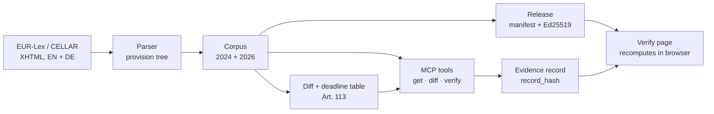

# EU AI Act: verifiable legal graph

**Check any quote from the EU AI Act against the right version of the law, on the right date, and share a proof that anyone can recompute in their browser.**

[](https://github.com/akoemek-dev/eu-ai-act-mcp/actions/workflows/test.yml)
[](https://akoemek-dev.github.io/eu-ai-act-mcp/)


→ **[Open the example evidence record](https://akoemek-dev.github.io/eu-ai-act-mcp/example/)**: a quote from Article 9(2), checked as of 1 September 2026. Result: the wording is exact, but the provision does not apply yet. It applies from 2 December 2027, or 2 August 2028 for Annex I systems.

<a href="https://akoemek-dev.github.io/eu-ai-act-mcp/example/"></a>

---

## The problem

The AI Act (Regulation (EU) 2024/1689) was amended in July 2026 by the Digital Omnibus on AI (Regulation (EU) 2026/1744). Application dates moved, provisions were inserted and removed. Texts written before the amendment, and language models trained on them, still describe the 2024 version.

So a sentence like *"high-risk obligations under Annex III apply from 2 August 2026"* is correct for the 2024 text and wrong for the current one, where the date is 2 December 2027. A compliance team cannot tell from the sentence alone, and a link to EUR-Lex does not prove what the text said on a given day.

## Who it is for

- **Compliance and legal teams** who need to show which version and date a statement relies on.
- **Builders of AI assistants** who want their agent to check legal quotes instead of trusting its training data.
- **Auditors and reviewers** who receive a claim and want to verify it without trusting the sender.

## What it does

| | |
|---|---|
| **Versioned corpus** | Both versions (Official Journal 2024, consolidated 2026), English and German, parsed into addressable provisions such as `art_5.par_1.a`. Same IDs across languages and versions. |
| **Citation check** | Given a quote, a claimed article and a date: does the wording exist, where exactly, in which version, is it applicable on that date, and is the language right. |
| **Diff** | What changed between 2024 and 2026, per provision, down to the word. |
| **MCP server** | Three read-only tools that an AI assistant (Claude, Cursor, any MCP client) can call. |
| **Signed releases** | Each corpus snapshot gets a manifest of SHA-256 hashes, signed with Ed25519. |
| **Evidence records** | One check, packed into a link. The [verify page](https://akoemek-dev.github.io/eu-ai-act-mcp/verify/) recomputes it in the browser against the signed release. No server, no account, no trust in the author required. |

## Example

An assistant quotes Article 57(1) from memory and says sandboxes must be operational by 2 August 2026. The tool finds the quote, but only in the 2024 text:

```jsonc
// aiact_verify_citation({ quote: "Member States shall ensure ... which shall be operational by 2 August 2026",
//                         claimed_ref: "Article 57(1)", as_of: "2026-09-01" })
{
  "status": "found_other_version",          // the wording exists, but not in the version that applies
  "version_checked": "02024R1689-20260727", // consolidated text, applicable on 2026-09-01
  "found_in_version": "32024R1689",         // the quote is from the 2024 Official Journal text
  "provision_id": "art_57.par_1",
  "validity": { "state": "superseded_by", "version": "02024R1689-20260727" },
  "support_checked": false                  // the tool checks wording and dates, never legal arguments
}
```

The current text says *"operational by 2 August 2027"*. A second example, where the wording is right but the date matters:

```jsonc
// aiact_verify_citation({ quote: "The risk management system shall be understood as a continuous iterative process ...",
//                         claimed_ref: "Article 9(2)", as_of: "2026-09-01" })
{
  "status": "exact",
  "validity": {
    "state": "not_yet_applicable_until", "until": "2027-12-02",
    "source_nodes": ["art_113.sub_3.c", "art_113.sub_3.c.i", "art_113.sub_3.c.ii"],
    "conditional_dates": [{ "date": "2028-08-02", "condition": "AI systems classified as high-risk pursuant to Article 6(1) and Annex I" }]
  }
}
```

Every date points to the sentence in Article 113 it comes from.

## How it works



A verification gives three separate answers, never one combined "verified":

- **V0, wording:** exact, fuzzy, found at another provision, found only in the other version or language, or not found. Numbers, dates and negations must match exactly.
- **V1, applicability:** applicable on the given date, not yet applicable until a date, superseded or inserted by the 2026 amendment. Based on a deadline table written from Article 113 of each version.
- **V2, language:** does the quote match the requested language.

## Key numbers

| | |
|---|---|
| Provisions | 1,437 operative provisions and 180 recitals (2024), 1,587 provisions (2026), per language |
| Operative provisions traceable from 2024 to 2026 | 98.7 % (EN), 98.6 % (DE) |
| EN/DE structural parity | 100 % |
| Application-date rules (2026 version) | 7, each linked to its source sentence in Art. 113 |
| Tests | 358, including golden tests written and frozen before implementation |
| Verify page | 52 KB, no framework, no external requests |

## Quick start

Requires Node 20+.

```bash
git clone https://github.com/akoemek-dev/eu-ai-act-mcp.git
cd eu-ai-act-mcp
npm ci
npm test
```

**Use it from Claude Code** (run inside the repository):

```bash
claude mcp add eu-ai-act -- "$(pwd)/node_modules/.bin/tsx" "$(pwd)/src/mcp/server.ts"
```

Then ask, for example: *"Is Article 9(2) of the AI Act applicable on 1 September 2026? Check it with the eu-ai-act tools."*

**Other MCP clients:** command `<repo>/node_modules/.bin/tsx`, argument `<repo>/src/mcp/server.ts`. The server runs locally over stdio and makes no network calls.

**Create your own evidence record:**

```bash
npm run record -- --quote "..." --ref "Article 9(2)" --as-of 2026-09-01 --lang en \
  --release aiact-corpus-2026-10-05
```

## Trust model

A record with a valid signature shows that the quoted passages read as stated in the signed corpus release, and that the check was recomputed on the page. It does not show who created the record, whether a legal claim is right, or that any system is compliant.

- Signing key `71fa6df7215bb8b9`, published at [`keys/index.json`](https://akoemek-dev.github.io/eu-ai-act-mcp/keys/index.json). The private key never touches the repository or CI.
- The record hash is plain SHA-256 over canonical JSON and can be recomputed in three lines of Python ([reference](docs/reference.md#evidence-record)).
- The consolidated text from EUR-Lex is not legally authentic. Only the Official Journal is binding. **Not legal advice.**

## Known limitations

- Articles 105 to 108 (amendments to other acts) are not fully structured.
- A provision that was both moved and reworded shows as removed plus added.
- Transitional rules for systems already on the market (Art. 111) are not in the deadline table.
- No lawyer has reviewed the deadline table yet. Every rule cites its source sentence so it can be checked.

Details in the [technical reference](docs/reference.md#known-limitations).

## Roadmap

- [x] Parser, diff and provision IDs for both versions, EN + DE
- [x] MCP tools with three-level verification
- [x] Signed releases, evidence records, browser verify page
- [ ] **Evaluation:** how often frontier models cite the wrong version or date, with and without these tools (pre-registered, in preparation)
- [ ] Hosted MCP endpoint
- [ ] Further acts: GDPR, Data Act, Cyber Resilience Act

## How this was built

I designed the specification, the data model, the verification levels and the trust model, and wrote the acceptance tests. Implementation was done by AI coding agents working under that control:

- **Each build step** had a written contract and a gate script. Golden tests were written and frozen before implementation; the agents could not change them.
- **Every merge** passed the gate and two independent reviews in a fresh context. The reviews found real defects, such as a silently redefined metric and an incomplete verdict on the verify page, which were fixed before merge.
- **Decisions** are recorded as ADRs in [`decisions/`](decisions/), research with sources in [`research/`](research/).

## Repository layout

| Path | Content |
|---|---|
| `src/` | Parser, diff, tools, MCP server, release, record, verify core |
| `data/` | Raw XHTML, parsed corpus, diffs, deadline table |
| `release/` | Signed corpus releases |
| `site/` | Landing page, verify page (GitHub Pages) |
| `tests/` | Unit and golden tests |
| `docs/reference.md` | Full technical reference |
| `decisions/`, `research/`, `plan/`, `log/` | Working notes in German: ADRs, research reports, build contracts, session logs |

## License

- Code: Apache-2.0 ([`LICENSE`](LICENSE))
- Legal texts: © European Union, [eur-lex.europa.eu](https://eur-lex.europa.eu), reuse under Commission Decision 2011/833/EU
- Own data (IDs, hashes, diffs, measurements): CC BY 4.0

See [`NOTICE`](NOTICE).

---

Built by [Altan Kömek](https://github.com/akoemek-dev).
