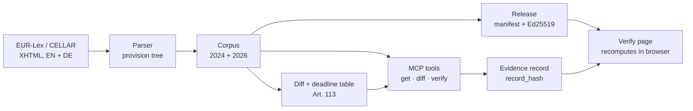

# EU AI Act: verifiable legal graph

**Check any quote from the EU AI Act against the right version of the law, on the right date, and share a proof that anyone can recompute in their browser.**

[](https://akoemek-dev.github.io/eu-ai-act-mcp/example/)


→ **[Open the example evidence record](https://akoemek-dev.github.io/eu-ai-act-mcp/example/)**: a quote from Article 5(1)(a), checked as of 1 September 2026 against a signed corpus release.

<a href="https://akoemek-dev.github.io/eu-ai-act-mcp/example/"></a>

---

## The problem

The AI Act (Regulation (EU) 2024/1689) was amended in 2026 by the 2026 Omnibus (Regulation (EU) 2026/1744). Application dates moved, provisions were inserted and removed. Most texts, tools and language models still quote the 2024 version.

So a sentence like *"high-risk obligations under Annex III apply from 2 August 2026"* can be correct for one version and wrong for the other. A compliance team cannot tell from the sentence alone, and a link to EUR-Lex does not prove what the text said on a given day.

## What this project does

| | |
|---|---|
| **Versioned corpus** | Both versions (Official Journal 2024, consolidated 2026), English and German, parsed into about 1,600 addressable provisions each, e.g. `art_5.par_1.a`. Same IDs across languages and versions. |
| **Citation check** | Given a quote, a claimed article and a date: does the wording exist, where exactly, in which version, does it apply on that date, and is the language right. |
| **Diff** | What changed between 2024 and 2026, per provision, down to the word. |
| **MCP server** | Three read-only tools that an AI assistant (Claude, Cursor, any MCP client) can call. |
| **Signed releases** | Each corpus snapshot gets a manifest of SHA-256 hashes, signed with Ed25519. |
| **Evidence records** | One check, packed into a link. The [verify page](https://akoemek-dev.github.io/eu-ai-act-mcp/verify/) recomputes it in the browser against the signed release. No server, no account, no trust in the author required. |

## How it works



A verification is split into three separate answers, never one combined "verified":

- **V0, wording:** exact, fuzzy, found at another provision, found only in the other version or language, or not found. Numbers, dates and negations must match exactly.
- **V1, validity:** in force on the given date, not yet applicable until a date, superseded or inserted by the Omnibus. Based on a deadline table written from Article 113 of each version.
- **V2, language:** does the quote match the requested language.

The tool checks wording and location. It does not judge whether a passage supports a legal argument, and it says so in every result.

## Key numbers

| | |
|---|---|
| Provisions per corpus file | 1,587 to 1,621 |
| Operative provisions traceable from 2024 to 2026 | 98.7 % (EN), 98.6 % (DE) |
| EN/DE structural parity | 100 % |
| Application-date rules (2026 version) | 7, each linked to its source sentence in Art. 113 |
| Tests | 343, including golden tests frozen before implementation |
| Verify page bundle | 45 KB, no framework, no external requests |

## Quick start

Requires Node 20+.

```bash
git clone https://github.com/akoemek-dev/eu-ai-act-mcp.git
cd eu-ai-act-mcp
npm ci
npm test
```

**Use it from Claude Code:**

```bash
claude mcp add eu-ai-act -- npx tsx "$(pwd)/src/mcp/server.ts"
```

Then ask, for example: *"Verify this quote from Article 5(1)(a) as of 2026-09-01: 'the placing on the market, the putting into service or the use of an AI system that deploys subliminal techniques'."*

**Other MCP clients:** command `npx`, args `["tsx", "src/mcp/server.ts"]`, working directory the repository root. The server runs locally over stdio and makes no network calls.

**Create your own evidence record:**

```bash
npm run record -- --quote "..." --ref art_5.par_1.a --as-of 2026-09-01 --lang en \
  --release aiact-corpus-2026-10-05
```

## Trust model

A record with a valid signature shows that the quoted passages read as stated in the signed corpus release, and that the check was recomputed on the page. It does not show who created the record, whether a legal claim is right, or that any system is compliant.

- Signing key `71fa6df7215bb8b9`, published at [`keys/index.json`](https://akoemek-dev.github.io/eu-ai-act-mcp/keys/index.json). The private key never touches the repository or CI.
- The record hash is plain SHA-256 over canonical JSON and can be recomputed in three lines of Python ([reference](docs/reference.md#evidence-record)).
- The consolidated text from EUR-Lex is not legally authentic. Only the Official Journal is binding. **Not legal advice.**

## Known limitations

- Articles 105 to 108 (amendments to other acts) are not fully structured.
- A provision that was both moved and reworded shows as removed plus added.
- Transitional rules for systems already on the market (Art. 111) are not in the deadline table.
- No lawyer has reviewed the deadline table yet. Every rule cites its source sentence so it can be checked.

Details in the [technical reference](docs/reference.md#known-limitations).

## Roadmap

- [x] Parser, diff and provision IDs for both versions, EN + DE
- [x] MCP tools with three-level verification
- [x] Signed releases, evidence records, browser verify page
- [ ] **Evaluation:** how often do frontier models cite the wrong version or date, with and without these tools (pre-registered, in progress)
- [ ] Hosted MCP endpoint
- [ ] Further acts: GDPR, Data Act, Cyber Resilience Act

## How this was built

Built by one person orchestrating AI coding agents, with every step gated:

- **Decisions** are recorded as ADRs in [`decisions/`](decisions/), research with sources in [`research/`](research/).
- **Each build day** had a written contract and a gate script ([`plan/`](plan/)). Golden tests were frozen before implementation started, and the agents could not modify them.
- **Every merge** passed the gate and two independent reviews by a separate model in a fresh context. The reviews found real defects, such as a silently redefined metric and an incomplete verdict on the verify page, which were fixed before merge.

## Repository layout

| Path | Content |
|---|---|
| `src/` | Parser, diff, tools, MCP server, release, record, verify core |
| `data/` | Raw XHTML, parsed corpus, diffs, deadline table |
| `release/` | Signed corpus releases |
| `site/` | Verify page (GitHub Pages) |
| `tests/` | Unit and golden tests |
| `docs/reference.md` | Full technical reference |
| `decisions/`, `research/`, `plan/`, `log/` | Project process: ADRs, research reports, build contracts, session logs |

## License

- Code: Apache-2.0 ([`LICENSE`](LICENSE))
- Legal texts: © European Union, [eur-lex.europa.eu](https://eur-lex.europa.eu), reuse under Commission Decision 2011/833/EU
- Own data (IDs, hashes, diffs, measurements): CC BY 4.0

See [`NOTICE`](NOTICE).

---

Built by [Altan Kömek](https://github.com/akoemek-dev).
