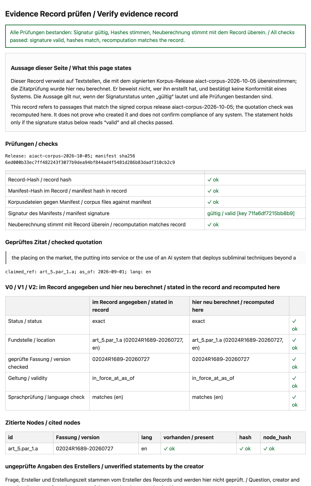
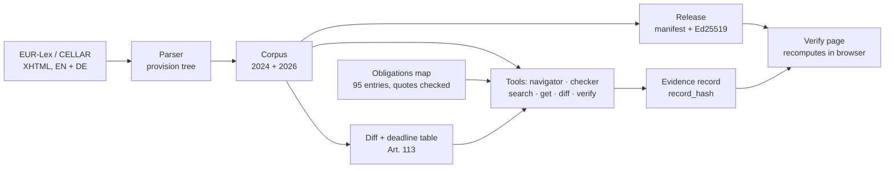

<picture>
  <source media="(prefers-color-scheme: dark)" srcset="docs/assets/hero-dark.svg">
  
</picture>

<p align="center">
  <a href="https://github.com/altanziya/eu-ai-act-mcp/actions/workflows/test.yml"></a>
  <a href="https://altanziya.github.io/eu-ai-act-mcp/"></a>
  <a href="https://github.com/altanziya/eu-ai-act-mcp/releases/tag/v0.1.0"></a>
  
  
  
</p>

<p align="center"><b>Which obligations apply to you and when. Whether a document still states the law correctly. A proof anyone can recompute.</b></p>

Every answer cites the provision, quotes it word for word from the text in force on your date, and says when it applies. Where the law requires a judgement, the tools say so instead of making it. Deterministic, no language model at runtime, runs in your browser or inside your AI assistant.

**Status:** v0.1.0 (October 2026), stable. [Changelog](CHANGELOG.md) · [Technical reference](docs/reference.md)

## Try it now

| In the browser | From your AI assistant |
|---|---|
| [Obligations navigator](https://altanziya.github.io/eu-ai-act-mcp/obligations/) · [Document checker](https://altanziya.github.io/eu-ai-act-mcp/audit/) · [Verify a record](https://altanziya.github.io/eu-ai-act-mcp/verify/)<br>Your text stays in your browser; the pages check the signature of the corpus release before using it. | `claude mcp add eu-ai-act -- npx -y github:altanziya/eu-ai-act-mcp`<br>Six read-only tools, local over stdio, no network calls. Node 20+. [Details](#install) |

Then ask, for example: *"We sell an AI tool that ranks job applicants. Which AI Act obligations apply to us and when? Use the eu-ai-act tools."*

## Why this exists

The AI Act (Regulation (EU) 2024/1689) was amended in July 2026 by the Digital Omnibus on AI (Regulation (EU) 2026/1744). Application dates moved, provisions were inserted, moved and removed. Policies, vendor answers, slide decks and language models still describe the 2024 version.

So *"high-risk obligations under Annex III apply from 2 August 2026"* is right for the 2024 text and wrong today: the date is 2 December 2027. We asked three frontier models 45 pre-registered questions on deadlines and versions of the AI Act after the 2026 amendment, without tools and in two runs with this project's tools:

<picture>
  <source media="(prefers-color-scheme: dark)" srcset="docs/assets/eval-dark.svg">
  
</picture>

Without tools the models were right on what the amendment left unchanged and wrong on almost everything it changed.

<details>
<summary><b>Numbers, caveats and where the raw data lives</b></summary>

| Model | No tools | With these MCP tools |
|---|---|---|
| Claude Opus 5.5 | 24/45 | 3/30 (v1) · 2/15 (v2) |
| GPT-6 Astra | 26/45 | 2/30 (v1) · 1/15 (v2) |
| Gemini 3.1 Pro | 25/42 | 5/27 (v1) · 2/12 (v2) |

Opus with web search: 6/45. The pre-registered rule for that arm (at least 5 % errors, lower 95 % bound) is formally met, but not robustly: it depends on one case with a known answer-key erratum, which we report up front. Each run also exposed tool weaknesses that were then fixed (date-aware version selection; showing inserted provisions such as Article 99(6a) next to the one asked for); the fixes after v2 are not yet measured. Cases, pre-registrations, raw answers and limitations: [`eval/results/`](eval/results/).

</details>

## Three things it does

### 1. Which obligations apply to us, and when?

Describe your organisation and AI system in a few fields: role (provider, deployer, importer, …), Annex III area or Annex I product, general-purpose model, transparency cases, company size. You get the obligations that apply now and the ones coming, each with provision, verbatim quote, date and days left, plus open questions where the answer depends on facts or a legal judgement.

```jsonc
// aiact_obligations({ profile: { role: ["provider"], annex_iii_area: "4", annex_iii_art6_3_exception_concluded: false, enterprise_size: "sme" },
//                     as_of: "2026-10-05" })  ->  30 obligations, high-risk via Annex III
{ "id": "risk-management-system", "status": "upcoming", "applies_from": "2027-12-02", "days_until": 423,
  "provisions": ["Article 9"], "quote_verified": true, "changed_by_omnibus": true },
{ "id": "conformity-assessment-annex-iii-internal", "applies_from": "2027-12-02",
  "applies_from_literal": "2026-08-02",   // Art. 113 literally leaves Chapter III Section 5 at the general date
  "deadline_caveat": "Literally, the residual rule of Art. 113 second paragraph (2026-08-02) applies …" },
{ "id": "ai-literacy", "status": "applicable", "applies_from": "2025-02-02", "changed_by_omnibus": true }
```

The map behind it covers 95 obligations, reliefs and transitional rules for providers, deployers, importers, distributors and authorised representatives. All 106 quotations are checked against the corpus on every build. The classification (Article 6(1) and 6(2), the Article 6(3) exception and its profiling override, Annex I Section A vs. B, systemic-risk GPAI, open-source exemptions) is explicit, versioned data, not code.

### 2. Is this document still right?

Paste a policy, a vendor's answer, a slide or a chatbot answer. The checker finds references, dates and quotations and compares them with the text in force on your date.



It knows deadlines written into provisions (Article 57(1): sandboxes "operational by 2 August 2027") as well as application dates from Article 113, recognises EN and DE citation styles, skips other acts (GDPR, Data Act, …), and checks quotations word for word. 5,000 words take well under a second.

### 3. Can I prove what the text said?

One check, packed into a link: the quotation, the version, the date and the result, hash-sealed and tied to a signed corpus release. The [verify page](https://altanziya.github.io/eu-ai-act-mcp/verify/) recomputes it in the browser. No server, no account, no trust in the author required.

→ **[Open the example evidence record](https://altanziya.github.io/eu-ai-act-mcp/example/)**: a quote from Article 9(2), checked as of 1 September 2026. The wording is exact, but the provision does not apply yet.

<p align="center"><a href="https://altanziya.github.io/eu-ai-act-mcp/example/"></a></p>

## The six MCP tools

| Tool | Answers | Ask your assistant |
|---|---|---|
| `aiact_obligations` | Obligations for a profile on a date, with quotes, dates, caveats and open questions | *"We deploy a CV-screening tool bought from a vendor. What applies to us, and from when?"* |
| `aiact_audit_text` | Outdated deadlines, moved or unknown provisions, wrong quotations in a text | *"Check this vendor answer against the current AI Act: …"* |
| `aiact_search` | Provisions by keyword in the version in force on a date (EN/DE) | *"Where does the Act talk about biometric categorisation?"* |
| `aiact_get_provision` | A provision in the version in force on a date, with applicability and neighbouring provisions | *"Show me Article 50(2) as it applies on 1 March 2027."* |
| `aiact_verify_citation` | Does a quotation exist, where, in which version, and does it apply on that date | *"Is this quote really in Article 9(2), and is it in force?"* |
| `aiact_diff` | What the 2026 amendment changed in a provision | *"What did the Digital Omnibus change in Article 6?"* |

All six are read-only. The server makes no network calls; the corpus ships with the package.

## How it works

<picture>
  <source media="(prefers-color-scheme: dark)" srcset="docs/assets/pipeline-dark.svg">
  
</picture>

<details>
<summary>Text version of the diagram</summary>



</details>

A verification gives three separate answers, never one combined "verified":

<picture>
  <source media="(prefers-color-scheme: dark)" srcset="docs/assets/levels-dark.svg">
  
</picture>

- **V0, wording:** exact, fuzzy, found at another provision, found only in the other version or language, or not found. Numbers, dates and negations must match exactly.
- **V1, applicability:** applicable on the given date, not yet applicable until a date, superseded or inserted by the 2026 amendment. Based on a deadline table written from Article 113 of each version.
- **V2, language:** does the quote match the requested language.

## Key numbers

| | |
|---|---|
| Provisions | 1,437 operative provisions and 180 recitals (2024), 1,587 provisions (2026), per language |
| Operative provisions traceable from 2024 to 2026 | 98.7 % (EN), 98.6 % (DE) |
| EN/DE structural parity | 100 % |
| Application-date rules (2026 version) | 7, each linked to its source sentence in Art. 113 |
| Obligations map | 95 entries, 106 verbatim quotations, all checked against the corpus |
| Tests | 983, including golden tests written before the implementation |
| Verify page | 52 KB, no framework, no external requests |

## Install

Requires Node 20+.

**Option A, no clone:**

```bash
claude mcp add eu-ai-act -- npx -y github:altanziya/eu-ai-act-mcp
```

For other MCP clients, use command `npx` with arguments `-y github:altanziya/eu-ai-act-mcp`. The first start builds the package (about a minute); after that the server runs locally over stdio and makes no network calls.

**Option B, from a clone:**

```bash
git clone https://github.com/altanziya/eu-ai-act-mcp.git
cd eu-ai-act-mcp
npm ci    # also builds dist/server.js
claude mcp add eu-ai-act -- node "$(pwd)/dist/server.js"
```

**Development:**

```bash
npm test
npm run mcp    # the server from the sources, via tsx
```

**Create your own evidence record:**

```bash
npm run record -- --quote "..." --ref "Article 9(2)" --as-of 2026-09-01 --lang en \
  --release aiact-corpus-2026-10-05
```

## Trust model

A record with a valid signature shows that the quoted passages read as stated in the signed corpus release, and that the check was recomputed on the page. It does not show who created the record, whether a legal claim is right, or that any system is compliant.

- Signing key `71fa6df7215bb8b9`, published at [`keys/index.json`](https://altanziya.github.io/eu-ai-act-mcp/keys/index.json). The private key never touches the repository or CI.
- The record hash is plain SHA-256 over canonical JSON and can be recomputed in three lines of Python ([reference](docs/reference.md#evidence-record)).
- The consolidated text from EUR-Lex is not legally authentic. Only the Official Journal is binding. **Not legal advice.**

## Known limitations

- Articles 105 to 108 (amendments to other acts) are not fully structured.
- A provision that was both moved and reworded shows as removed plus added.
- Transitional rules for systems already on the market (Art. 111) are in the obligations map, not in the deadline table.
- The obligations map covers duties of operators, not of authorities, the Commission or notified bodies, and covers sector-specific reliefs only for financial institutions.
- The document checker reads citations, dates and quotations; it does not judge legal arguments. Relative deadlines ("two years after entry into force") are not resolved.
- No lawyer has reviewed the deadline table or the obligations map yet. Two independent model reviews found and fixed errors; every entry cites its source so it can be checked.
- Exactly two versions of the Act are built in: the Official Journal text and the consolidated text after the Digital Omnibus. A further amendment needs code changes, not only new data.
- English and German only.
- Releases are signed with a single key. A key can be revoked through the key list; there is no key rotation yet.
- In German mode the obligations navigator quotes the English text.

Details in the [technical reference](docs/reference.md#known-limitations).

## Roadmap

- [x] Parser, diff and provision IDs for both versions, EN + DE
- [x] MCP tools with three-level verification
- [x] Signed releases, evidence records, browser verify page
- [x] **Evaluation:** pre-registered run with three frontier models, with and without these tools, extended to 45 cases ([results](eval/results/))
- [x] Obligations navigator, document checker and search, as MCP tools and browser pages
- [ ] Re-run the evaluation with the current tools, including the navigator and checker
- [ ] Legal review of the obligations map
- [ ] Hosted MCP endpoint
- [ ] Further acts: GDPR, Data Act, Cyber Resilience Act

## How this was built

This project was built with AI coding agents under my direction. I set the goal and the scope, decided at each gate what to build, what counts as done and what to publish, reviewed the results and am responsible for the errors. The agents wrote the research drafts, the specification, the tests and the code:

- **Each build step** had a written contract and an acceptance script. The expected results (golden tests) were fixed by the orchestrating agent before the implementing agent started, and the implementing agent could not change them.
- **Every merge** passed the acceptance script and two independent reviews in a fresh context. The reviews found real defects, such as a silently redefined metric and an incomplete verdict on the verify page, which were fixed before merge.
- **The legal content** (deadline table, obligations map) was checked by two independent model reviews, not yet by a lawyer; every entry cites its source so it can be checked.

## Repository layout

| Path | Content |
|---|---|
| `src/` | Parser, diff, tools (navigator, checker, search, verify), MCP server, release, record, browser pages |
| `data/` | Raw XHTML, parsed corpus, diffs, deadline table, obligations map |
| `release/` | Signed corpus releases |
| `site/` | Landing page, obligations navigator, document checker, verify page (GitHub Pages) |
| `tests/` | Unit and golden tests |
| `docs/reference.md` | Full technical reference |

## License

- Code: Apache-2.0 ([`LICENSE`](LICENSE))
- Legal texts: © European Union, [eur-lex.europa.eu](https://eur-lex.europa.eu), reuse under Commission Decision 2011/833/EU
- Own data (IDs, hashes, diffs, measurements): CC BY 4.0

See [`NOTICE`](NOTICE).

---

Built by [Altan Kömek](https://github.com/altanziya).
